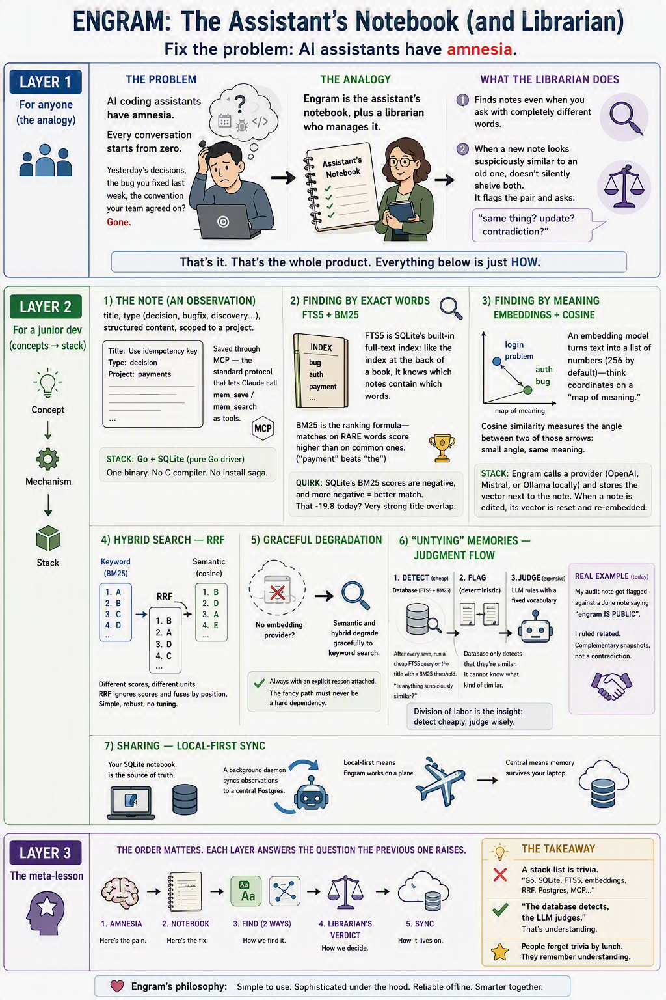

# How engram works

A plain-language tour of engram's engine. The [README](../README.md) is the
reference manual; this page explains the *ideas* behind it — what problem
engram solves and how each piece of machinery serves that problem.

  

## The problem: amnesia

AI coding assistants forget everything between sessions. Yesterday's
decisions, the bug fixed last week, the convention the team agreed on — every
conversation starts from zero, and the developer pays to re-explain their own
project every day.

## The analogy: a notebook and a librarian

engram is the assistant's notebook, plus a librarian who manages it. When the
assistant makes a decision or fixes a bug, it writes a note. At the start of
the next session it reads the notebook back. The librarian does two special
things:

1. **Finds notes even when asked with completely different words.**
2. **Never silently shelves two suspiciously similar notes.** It flags the
   pair and asks: same thing, an update, or a contradiction?

Everything below is the *how* behind those two promises.

## The note: an observation

A memory is an **observation**: a short searchable title, a type (`decision`,
`bugfix`, `discovery`, …), structured content, scoped to a project. Related
saves can share a `topic_key`, which makes a re-save update the same chain
instead of duplicating it.

Agents write and read observations through the
[Model Context Protocol](https://modelcontextprotocol.io/) — `mem_save`,
`mem_search`, and friends are ordinary MCP tools. Storage is a single SQLite
file (WAL mode) accessed by a pure-Go driver, so the whole engine ships as one
binary: no C toolchain, no database server, no install ceremony.

## Finding by exact words: FTS5 + BM25

SQLite's FTS5 extension maintains a full-text index — like the index at the
back of a book, it knows which observations contain which words. Results are
ranked with **BM25**, a relevance formula that rewards matches on rare words
("payment" outranks "the").

One quirk worth knowing: SQLite reports BM25 scores as *negative* numbers,
and **more negative means a stronger match**. A score of −19 is a very strong
match; −2 is weak.

## Finding by meaning: embeddings + cosine similarity

Keyword search fails when the words differ but the meaning doesn't — "login
problem" versus "auth bug". For that, engram uses **embeddings**: an external
model turns text into a vector of numbers (256 dimensions by default,
configurable to match the provider) that acts like coordinates on a map of
meaning. Texts about the same thing land close together.

**Cosine similarity** measures the angle between two of those vectors: the
smaller the angle, the closer the meaning. engram calls a configured provider
(OpenAI, Mistral, a local Ollama, or a custom endpoint) at save time and
stores the vector alongside the observation.

A correctness detail: when an observation is edited, its stored vector is
deliberately reset and the content re-embedded. A stale vector would make
semantic search lie about what the note now says.

## Hybrid search: reciprocal rank fusion

Keyword and semantic search each return a ranked list, but their scores are
different units — averaging a BM25 score with a cosine score is like averaging
meters with kilograms. **Reciprocal Rank Fusion (RRF)** ignores the scores
entirely and fuses by *position*: an item ranked high in both lists wins.
Simple, robust, and there is nothing to tune.

`mem_search` exposes all three modes: `fts` (default), `semantic`, and
`hybrid`.

## Graceful degradation

Semantic and hybrid modes require an embedding provider. When none is
configured — or the provider is unreachable — they **degrade to keyword
search and say so explicitly** in the response rather than failing. The fancy
path is never a hard dependency: engram with no API key is still a fully
working memory engine.

## Untying memories: the judgment flow

Two notes about the same topic can relate in many ways — one may update the
other, narrow it, or contradict it. engram splits the work between the
database and the LLM, each doing what it is good at:

1. **Detect (cheap, deterministic).** After every save, the database runs an
   FTS5 query built from the new observation's title, filtered by a BM25
   threshold: "is anything suspiciously similar?" Soft-deleted observations
   and other projects are excluded.
2. **Flag.** Each candidate pair is recorded as a pending relation, and the
   `mem_save` response tells the agent judgment is required.
3. **Judge (expensive, semantic).** The agent rules on each pair via
   `mem_judge` using a fixed vocabulary: `related`, `compatible`, `scoped`,
   `supersedes`, `conflicts_with`, or `not_conflict`.

The division of labor is the point: the database can detect *that* two notes
are similar but cannot know *what kind* of similar. That judgment call needs
language understanding, so it is delegated to the model — and only for the
pairs the cheap scan flagged.

## Sharing: local-first sync

The local SQLite file is the source of truth. Optionally, a background daemon
replicates observations to a central Postgres server over HTTP with
HMAC-SHA256 per-writer authentication, reconciling with last-write-wins.
Autosync runs on an interval (30 seconds by default) plus an immediate
trigger on every write.

Local-first means engram works on a plane. Central means memory survives a
laptop and can be shared across machines and teammates.

## The design principles

- **The database detects; the LLM judges.** Deterministic, cheap machinery
  narrows the problem; expensive language understanding is spent only where
  it is needed.
- **The fancy path is never a hard dependency.** No embedding provider, no
  network, no central server — every layer degrades to something that still
  works.
- **Local-first, one binary.** SQLite plus pure Go keeps the barrier to entry
  at "download and run".
